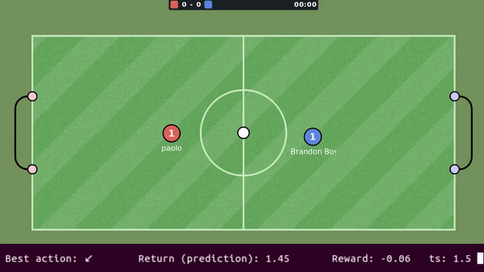

# Haxball-AI

* [Talk on Machine Learning Milan event](https://youtu.be/Ma_MopOXLCg)
* [Full gameplay demostration video](https://youtu.be/fpIe6lNM1NE)

This is an implementation of a bot for [haxball](https://www.haxball.com/) problem using Reinforcement Learning.

*Attention! This repo does not provide any connector to the browser!*

### Requirements

python 3.6+
Cython
Tensorflow (1.13+)

### Installation

Installation of dependencies

    pip install -r requirements.txt

Simulator compilation with Cython
 
    cd simulator && python setup.py build_ext --inplace
    
### Training

[PPO2](https://openai.com/blog/openai-baselines-ppo/) algorithm from [OpenAI-baselines](https://github.com/openai/baselines/) was used for training.
